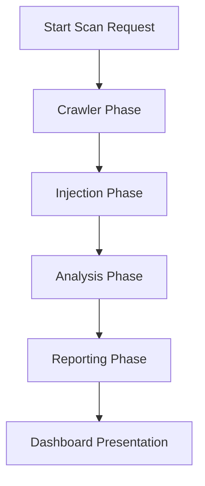

# SQLGuard - SQL Injection Scanner & Security Dashboard

SQLGuard is an automated web application vulnerability scanner specifically designed to detect, analyze, and report SQL Injection (SQLi) vulnerabilities. Featuring a modern, real-time interactive dashboard, SQLGuard crawls target web applications, identifies entry points, performs controlled injection testing, and presents a visual analysis of security findings.

---

## 🛠️ Tech Stack

SQLGuard is built on a modern, robust asynchronous stack:

- **Backend Framework:** Python & Flask
- **Task Queue & Async Processing:** Celery
- **Message Broker & Cache:** Redis
- **Database ORM:** SQLAlchemy (supporting PostgreSQL / SQLite)
- **Frontend Presentation:** HTML5, CSS3 (Vanilla), JavaScript (ES6+)
- **Data Visualization:** Chart.js
- **Containerization:** Docker & Docker Compose

---

## 🚀 Key Scanner Features

- **SQL Injection Detection Engines:**
  - **Error-Based SQLi:** Detects vulnerabilities by parsing detailed database server error messages returned in HTML responses.
  - **Boolean-Based Blind SQLi:** Identifies vulnerabilities by comparing variations in application response content for true vs. false SQL conditions.
  - **Time-Based Blind SQLi:** Injects delay payloads (e.g., `sleep`) and monitors latency spikes to confirm SQL execution.
  - **Union-Based SQLi:** Leverages `UNION SELECT` operations to retrieve schema metadata and table content.
- **Intelligent Crawler:** Discovers web pages recursively, extracts HTML forms, maps query parameters, and catalogs inputs for targeted scanning.
- **Interactive Security Dashboard:** Displays real-time scan progress, live console output logs, historical summaries, vulnerabilities classification charts, and cached RSS cybersecurity feeds.

---

## 📦 Installation & Configuration

Follow these steps to set up SQLGuard locally:

### 1. Clone the Repository
```bash
git clone https://github.com/MuhammadZain07/SQLGuard.git
cd SQLGuard
```

### 2. Set Up a Virtual Environment
```bash
# Windows
python -m venv venv
venv\Scripts\activate

# macOS/Linux
python3 -m venv venv
source venv/bin/activate
```

### 3. Install Dependencies
```bash
pip install -r requirements.txt
```

### 4. Configure Environment Variables
Create a file named `.env` in the root directory and define the following variables:
```env
SECRET_KEY=your_super_secret_jwt_and_session_signing_key
DATABASE_URL=sqlite:///sqlguard.db
REDIS_URL=redis://localhost:6379/0
```

---

## 🏃 Run Instructions

You can run SQLGuard natively or using Docker.

### Native Execution

#### 1. Start the Redis Service
Make sure Redis is installed and running on your system:
```bash
# Windows (WSL / native service)
redis-server

# macOS (Homebrew)
brew services start redis
```

#### 2. Start the Celery Worker
Run the background task processor:
```bash
celery -A celery_worker.celery worker --loglevel=info
```

#### 3. Run the Flask Web Application
Run the web development server:
```bash
python run.py
```
Open your browser and navigate to `http://127.0.0.1:5000`.

### Docker Compose Deployment
Alternatively, deploy the entire stack using Docker Compose:
```bash
docker-compose up --build
```
This starts the Flask app, Celery worker, and Redis services in isolated, configured containers.

---

## 📐 Architecture & Scan Workflow

SQLGuard executes scans through a four-phase pipeline:



1. **Crawler Phase:** Recursively traverses the target domain, extracting URLs, analyzing query strings, and parsing HTML forms to map potential injection vectors.
2. **Injection Phase:** Formulates targeted SQL payloads representing Error-Based, Boolean, Time, and Union injection types, then submits them to each target input.
3. **Analysis Phase:** Monitors HTTP responses. Analyzes headers, status codes, HTML body contents for database exception strings, time offsets (delays), or page differences.
4. **Reporting Phase:** Classifies vulnerabilities by severity (Critical, High, Medium, Low), generates CVSS vectors, commits records to the database, and pushes live updates to the dashboard via API.

---

## 🔌 API Reference & Endpoints

SQLGuard exposes endpoints for administration, triggering scans, retrieving statuses, and consuming security feeds:

### Page Routes
- `GET /dashboard` - Main administrative dashboard and statistics.
- `GET /history` - List of all historical scans.
- `GET /reports` - PDF or HTML vulnerability reports archive.
- `GET /profile` - User profile details and settings.

### API Endpoints
- `POST /start-scan` - Initiates a Celery task for a new target scan.
  - **Payload:** `{"target_url": "http://example.com", "mode": "normal"}`
  - **Response:** `{"scan_id": 1, "task_id": "uuid-string", "status": "pending"}`
- `POST /stop-scan/<id>` - Interrupts and stops a running scan task.
  - **Response:** `{"status": "stopped"}`
- `GET /scan-status/<id>` - Returns progress percentage, scan state, logs, and vulnerability counts.
  - **Response:**
    ```json
    {
      "status": "running",
      "progress": 45,
      "logs": ["Crawling started...", "Form found on /login..."],
      "vuln_count": 2,
      "severity_counts": {
        "critical": 0,
        "high": 1,
        "medium": 1,
        "low": 0
      }
    }
    ```
- `GET /api/news` - Serves cached RSS feed items from *The Hacker News*.
  - **Response:** `[{"title": "Critical SQL Injection in CMS", "link": "...", "date": "..."}]`
